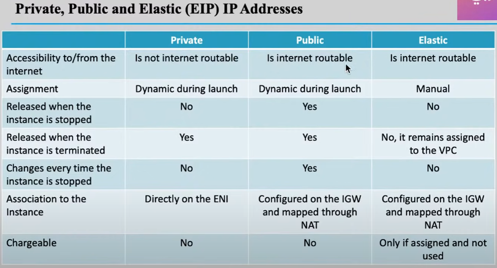

## AWS Cloud SAA-C03

### Elastic Network Interface (ENI)
- A virtual network card assigned to an EC2 instance, derived from the physical host during virtualization. 
- Enables network connectivity for the instance.
- By default, it is named `Eth0`, which serves as the primary **ENI**.
- **Note**: 
    - Every EC2 instance must have a primary ENI (`Eth0`) at creation.
    - When the EC2 instance is terminated, the primary ENI (`Eth0`) is automatically deleted.

---

## Storage Types of EC2 Instances (Root Volume Types)

### 1. EBS-Backed EC2 Instance
- Relies on an **EBS Volume** as its root volume, which hosts the operating system.
- The EC2 instance communicates with the primary drive (hosting the OS) via the network **ENI** within the same **Availability Zone (AZ)**.

#### Elastic Block Storage (EBS) Volume
- Can be considered as an external hard drive for your laptop.
- Provides persistent block storage for EC2 instances and remains available independently of the instance lifecycle.
- **Note**:
    - Multiple EBS volumes can be created and attached to the same EC2 instance in addition to the **root EBS volume**. These additional volumes are referred to as **data volumes**.
    - By default, **EBS volumes** are not encrypted, but encryption can be enabled.

### 2. Instance Storage
- Keeps the operating system on the same physical server as the instance, instead of communicating with the **EBS root volume** via `ENI`.
- **Instance Store** is a part of the disk that exists on the physical server itself, dedicated to the instance.
- **Advantages**:
    - Very high IOPS and fast performance, making it ideal for workloads like databases where fast read/write access is critical.
- **Disadvantages**:
    - Volatile storage: Data is lost when the instance is stopped or terminated.

---

## Comparison Between Private, Public, and Elastic IP

### Private IP
- Exists on the `ENI` of an EC2 instance in a private or public subnet.
- Used for internal communication within the VPC.

### Public IP
- Assigned automatically to an EC2 instance in a public subnet when it is launched.
- Allows communication with the internet via the Internet Gateway (IGW).

### Elastic IP
- A static public IP address that can be associated with an EC2 instance or a NAT Gateway.
- By default, there is a limit of **5 Elastic IPs** per region. You can request AWS to increase this limit if needed.
- Useful for maintaining a consistent public IP address even if the instance is stopped or restarted.

---

## Network Address Translation (NAT) Gateway

.png)

### NAT Overview
- **NAT**:
    - A table mapping the **Public IP** of an EC2 instance to its **Private IP**.
    - Ensures that traffic coming from the **Public IP** is forwarded to the correct EC2 instance.

### Important Notes
- All EC2 instances within the same VPC that map their private IPs to public IPs using **NAT** and access the internet share the same **Elastic IP** of the NAT Gateway.
- The difference between each EC2 instance's IP address is the **port** of the Elastic IP.
- This process is managed using **Port Address Translation (PAT)**.

---

# EC2 Deep Dive